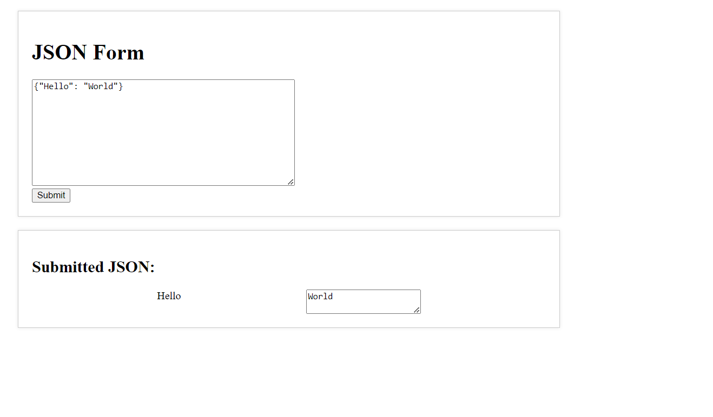

# Exactspace_NodeJs_Assignment

# Display JSON Data as a Form on a Webpage using Node.js

This guide will walk you through the process of creating a Node.js web application that takes JSON input and displays it as a form on a webpage.
## Tech Stack

**Client:** `HTML`, `CSS`, `JAVASCRIPT`

**Server:** `Node.js, Express.js.


## 🔗 Links
Github Link:- https://github.com/atulsanini7900/Exactspace_NodeJs_Assignment

## 🔗 Live Demo
Render Link:- https://exactspace-nodejs-assignment-mgfe.onrender.com/

## Prerequisites

- Node.js installed on your machine
- Basic understanding of JavaScript and HTML

## Steps

1. **Setup Project:**

   Create a new folder for your project and navigate to it in the terminal.

2. **Initialize Project:**

   Run the following command to initialize a new Node.js project and create a `package.json` file:

   ```bash
   npm init -y

   ### Step 3: Start the Application

Run the following command to start the server.

``npm start``
### Step 4: Access the Application

Open your web browser and visit http://localhost:3000 to access the Exactspace_NodeJs_Assignment.

 ## Folder Structure
```
Exactspace_NodeJs_Assignment/

├── routes/
│   ├── index.js
|   |

├── views/
│   ├── index.html
│   ├── script.js
│   ├── style.css
|   |
├── .gitignore
|   |
├── index.js
├── package-lock.json
├── package.json
├── README.md

  ## Screenshots

- Display Output
  